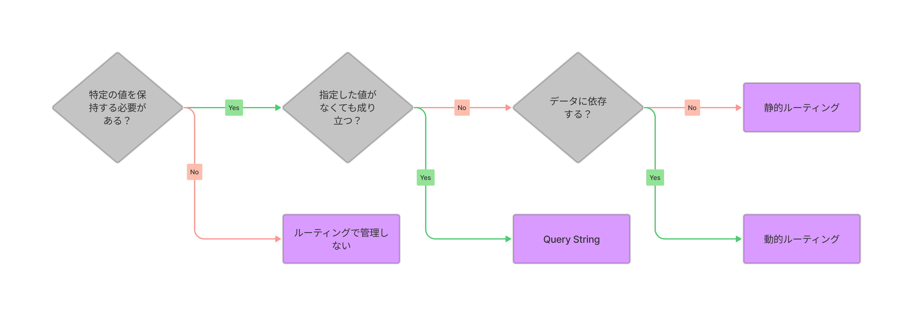
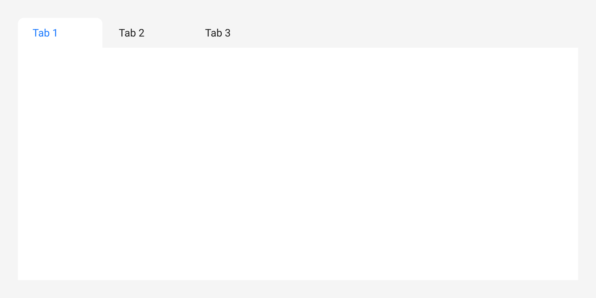
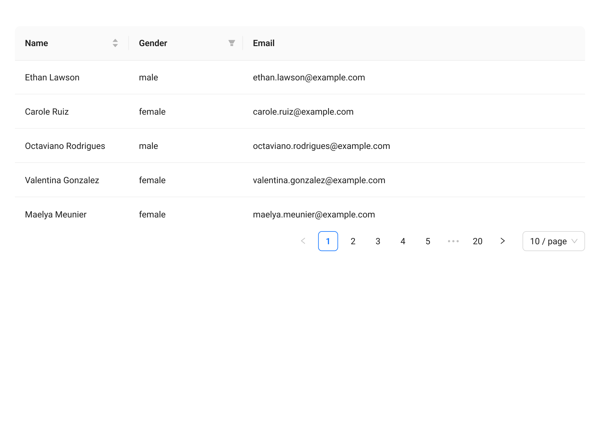

# デザイナーのための<br />Webサイトルーティング

---
## ルーティングとは

URLに対して何を返すかというルール

- `https://xxxxx.com`
-> トップページ
- `https://xxxxx.com/articles`
-> 記事一覧ページ
- `https://xxxxx.com/articles/1`
-> 記事詳細ページ

---
## 動的ルーティング

データに依存したルーティング

- `https://xxxxx.com/articles/scrum`
  - `articles`の後ろの`scrum`というslugのデータの情報に依存している
  - `scrum`というslugのデータが存在しなければエラーとなる
  - `scrum`のような意味のあるslugではなく、データを特定できる一意のIDが指定されることも多い
    - 例: `https://xxxxx.com/articles/12345`

---
## 同じようなURLの構造でもフロントで完結している場合は静的なルーティングです

- `https://xxxxx.com/contact/mail`
  - `mail`は`mail`というデータを参照しているわけではないので静的ルーティング
  - 静的ルーティングと動的ルーティングは同一階層で混在できるが、制約があり難しいのでよほどの理由がない限りおすすめはしません

---
## Query String

付加情報を持ったルーティング

- https://xxxxx.com/articles?page=2
  - `?articles=2`の部分がquery string
  - `articles`というキーに`2`という値が設定されている -> 一覧ページの2ページ目を表示

---
## ルーティングを使わない値の保持

ルーティングを使わずにjavascriptで値を保持し、ページ内のコンテンツを出し分けることができる

```js
// URL: https://xxxxx.com/articles
let selectedPage = 1 // 初期値

const onClickButton = (page) => {
  selectedPage = page
}
```

リロードしたら`selectedPage`は初期値になる -> URLで共有できない

---
## その他の値保持方法

Cookie、LocalStorageなどを使用する方法がありますが主旨がずれるので省略

---
## どうやって使い分ける？



---
## どうやって使い分ける？
### 特定の値を保持する必要がある？

- ない -> ルーティングで値を管理しない -> JavaScriptで値を保持
- ある -> なんらかの方法でルーティングで保持

---
## どうやって使い分ける？
### 指定した値がなくても成り立つ？

- 成り立つ -> query string
- 成り立たない -> その他のルーティングで保持

---
## どうやって使い分ける？
### データに依存する？

- しない -> 静的ルーティング
- する -> 動的ルーティング

---
## どうやって使い分ける？
### もっと複雑なんだけど、、

悩みましょう

---

## 例1: タブ



---
- 特定の値を保持する必要がある？
  - 初期表示やリロードで何も選択されない or 特定のタブが選択された状態でいい？
- 指定したデータがなくても成り立つ？
  - データがなかったら初期値を表示で問題ない？ (そもそも初期値という概念が成り立つ？)
- データに依存する？
  - データによってタブの項目が動的に変わる？

---
## 例2: 検索条件、ソート、ページネーション



---
- 特定の値を保持する必要がある？
  - 初期表示やリロードで絞り込み、ソート、ページがデフォルト値になってもいい？
- 指定したデータがなくても成り立つ？
  - デフォルト値を使用すればいいので成り立つはず
- データに依存する？
  - 検索結果のコンテンツは依存するが、ページ自体は特定のデータがあることを前提としているわけではない

---
## 例3: ブログ記事


---
- 特定の値を保持する必要がある？
  - 記事を特定する一意の値 (ID、Slugなど) がわからないといけない
- 指定した値がなくても成り立つ？
  - 指定した値がないと記事のデータが取得できない
- データに依存する？
  - 記事データを取得しないと記事が表示できないので依存する
